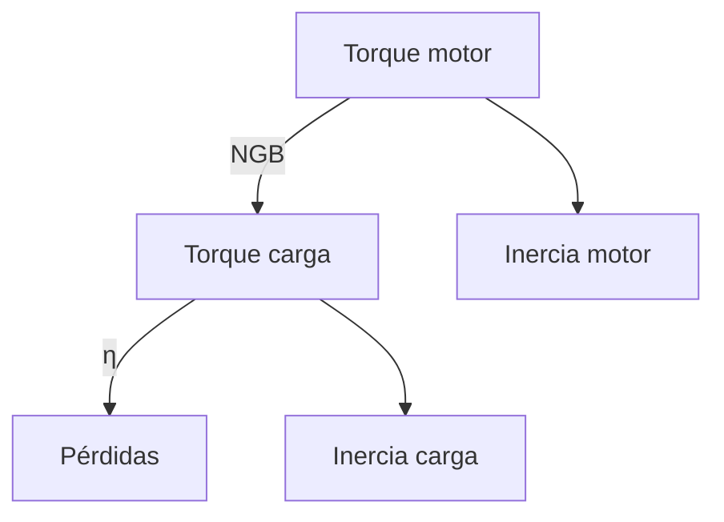

# Diseño de Transmisión en Control de Movimiento - Ampliado
 
## 1. Introducción  
 
El diseño de transmisiones en sistemas de control de movimiento es una disciplina crítica en ingeniería mecatrónica y automatización. Estos sistemas son responsables de convertir eficientemente el movimiento rotacional generado por un motor en el movimiento lineal o rotacional deseado en la carga final, ya sea una herramienta industrial, un brazo robótico o cualquier otro actuador mecánico.
 


Fig 1. Sitemas de transmision.

**Aspectos fundamentales a considerar:**

- **Precisión de movimiento:** Capacidad del sistema para alcanzar posiciones deseadas sin error

- **Dinámica del sistema:** Respuesta temporal ante cambios en la referencia
 
- **Eficiencia energética:** Minimización de pérdidas por fricción y otros factores

- **Robustez:** Capacidad de mantener el desempeño bajo variaciones de carga y condiciones ambientales

**Ejemplo de aplicación industrial:**
En una máquina CNC, el sistema de transmisión debe garantizar:

1. Posicionamiento preciso del cabezal de corte (μm de precisión)

3. Movimientos rápidos entre puntos (alta aceleración)

5. Capacidad para mantener fuerzas de corte constantes

---

## 2. Temas Principales  

### 2.1 Requerimientos de Diseño 

**Análisis detallado:**

1. **Torque del motor:**

   - Debe superar el torque estático (para vencer rozamiento)
  
   - Y el torque dinámico (para lograr aceleraciones deseadas)
  
   - Fórmula completa:
  
     $T_{\text{total}} = T_{\text{static}} + J_{\text{total}}$
     
     Donde α es la aceleración angular requerida

3. **Inercia equivalente:**
   - La inercia total vista por el motor afecta directamente:
  
     - Tiempos de respuesta

     - Consumo energético

     - Estabilidad del control

4. **Margen de seguridad recomendado:**

   - 20-30% para aplicaciones generales
  
   - Hasta 50% en aplicaciones críticas o con cargas variables

**Ejemplo ampliado:**

Para un sistema que requiere:

- Torque estático: 5 Nm

- Torque dinámico: 3 Nm (para J=0.01 kg·m² y α=300 rad/s²)

- Margen de seguridad: 30%

Cálculo:

$T_{\text{req}} = (5 + 3) \times 1.3 = 10.4 \, \text{Nm}$

**Tabla de selección típica:**

| Parámetro | Valor mínimo | Valor recomendado |
|-----------|--------------|-------------------|
| Torque    | 8 Nm         | 10.4 Nm           |
| Velocidad | 2000 rpm     | 2500 rpm          |
| Potencia  | 1.67 kW      | 2.72 kW           |

---

### 2.2 Tipos de Problemas de Diseño  

**Profundización en cada caso:**

**Caso 1: Diseño completo**

1. Determinar perfiles de movimiento (S-curve, trapezoidal)
  
3. Calcular requisitos de torque/velocidad

5. Seleccionar motor (considerando picos y RMS)

7. Diseñar transmisión (relación, eficiencia)

**Caso 2: Validación de sistema existente**
- Simular respuesta temporal

- Verificar márgenes de seguridad

- Analizar puntos críticos (sobrecalentamiento, resonancias)

---

### 2.3 Inercia y Torque Reflejado  
**Teoría avanzada:**

**Inercia reflejada:**

- Concepto fundamental en dinámica de sistemas

- Análogo rotacional a la masa equivalente en sistemas lineales

- Depende cuadráticamente de la relación de transmisión

**Torque equivalente:**

- Incluye componentes:

  - Torque de aceleración
 
  - Torque por fricción

  - Torque gravitacional (en ejes verticales)

**Ejemplo completo:**

Sistema con:

- Carga: 50 Nm (Tl)

- Eficiencia: 97%

- Relación: 5:1

- Inercia carga: 0.1 kg·m² 

- Aceleración deseada: 100 rad/s²

Cálculos:

1. Torque reflejado:

$T_m = \frac{50}{0.97 \times 5} + \frac{0.1}{5^2} \times 100 \approx 10.3 + 0.4 = 10.7 \, \text{Nm}$

2. Potencia requerida a 1000 rpm:

   $P = 10.7 \times \frac{1000 \times 2\pi}{60} \approx 1.12 \, \text{kW}$

**Diagrama de cuerpo libre rotacional:**


---

### 3. Consideraciones Avanzadas

#### 3.1 Análisis de Eficiencia 

**Factores que afectan η:**  

- Tipo de engranajes (rectos, helicoidales, planetarios)

- Materiales y lubricación

- Velocidad de operación  

**Tabla comparativa:**  

| Tipo Transmisión      | Eficiencia típica |  
|-----------------------|------------------|  
| Engranajes rectos     | 93-97%           |  
| Engranajes helicoidales | 95-98%         |  
| Tornillo sin fin      | 30-90%           |  
| Poleas/correas        | 95-98%           |  

#### 3.2 Backlash y Precisión  

**Técnicas de compensación:** 

- Engranajes anti-backlash

- Control por torque + posición

- Algoritmos de compensación en software  

**Ecuación de error posicional:**  

 $θ_error = Backlash / N_GB$

 
#### 3.3 Simulación Avanzada  
**Modelado en Simscape Multibody:**

```
% Sistema completo motor-transmisión-carga
sys = 'motor_transmission_load';
open_system(sys);

% Configuración de parámetros
set_param([sys '/Gearbox'], 'Ratio', '5');
set_param([sys '/Gearbox'], 'Efficiency', '0.97');

% Análisis modal
modalAnalysis(sys);

% Simulación temporal
simOut = sim(sys, 'StopTime', '10');

```

### Resultados típicos a analizar:

- **Respuesta al escalón**

- **Análisis de frecuencia**

- **Pérdidas por fricción**

- **Distribución de cargas**  

## 4. Ejercicios Propuestos

### Ejercicio 1: Selección de Motor
 
**Enunciado:**

Una carga requiere un torque de 12 Nm a 100 rpm. La transmisión tiene una relación \( N_{\text{GB}} = 3 \) y eficiencia \( \eta = 0.9 \). Determine el torque mínimo requerido en el motor.

**Solución:**

$T_m = \frac{T_{\text{load}}}{\eta \cdot N_{\text{GB}}} = \frac{12}{0.9 \times 3} \approx 4.44 \, \text{Nm}$

**Consideraciones adicionales:**

- **Margen de seguridad:** Si se aplica un 20% adicional:  

  $T_{\text{motor}} \geq 4.44 \times 1.2 \approx 5.33 \, \text{Nm}$
  
- **Potencia requerida:**  

  $P = T_m \cdot \omega = 4.44 \times \left(\frac{100 \times 2\pi}{60}\right) \approx 46.5 \, \text{W}$

---

### Ejercicio 2: Cálculo de Torque y Potencia del Motor

### Enunciado:

Un sistema de elevación requiere un torque de 18 Nm a 150 rpm en el eje de salida. La transmisión tiene una relación de reducción (N) = 4 y una eficiencia (η) = 0.85. Determine:

1. El torque mínimo requerido en el motor
2. La potencia requerida por el motor
3. El torque con un margen de seguridad del 25%

### Solución:

### 1. Torque mínimo en el motor

$T_{motor} = \frac{T_{salida}}{\eta \times N} = \frac{18}{0.85 \times 4}$

$T_{motor} = \frac{18}{3.4} \approx 5.29 \, \text{Nm}$

### 2. Potencia requerida

Primero calculamos la velocidad angular del motor (ω):

$omega_{motor} = \omega_{salida} \times N = \left( \frac{150 \times 2\pi}{60} \right) \times 4$

$omega_{motor} = 15.708 \times 4 = 62.832 \, \text{rad/s}$

Ahora calculamos la potencia:

$P = T_{motor} \times \omega_{motor} = 5.29 \times 62.832 \approx 332.4 \, \text{W}$

### 3. Torque con margen de seguridad

$T_{seguridad} = T_{motor} \times 1.25 = 5.29 \times 1.25 \approx 6.61 \, \text{Nm}$

### Consideraciones adicionales:

- La eficiencia de la transmisión afecta directamente el torque requerido

- El margen de seguridad es recomendable para cubrir picos de carga

- La potencia calculada es la mínima teórica, en la práctica se debe seleccionar un motor con mayor capacidad

---

## 5. Referencias Bibliográficas  

1. **Vallery, H. & van Dijk, J.** (2020). *Control of Motion Systems*. Elsevier.  
   - Capítulos 4 y 5: Modelado dinámico y selección de actuadores.  

2. **Beards, C.** (1996). *Dynamics of Mechanical Systems*. CRC Press.  
   - Sección 8.3: Inercia equivalente en sistemas rotacionales.  

3. **MathWorks** (2023). *Documentación de Simscape Multibody*.  
   - Tutoriales: "Modelado de transmisiones mecánicas".  

4. **Apex Dynamics** (2023). *Catálogo de Engranajes*.  
   - Tablas de eficiencia y curvas de vida útil para engranajes planetarios.  


